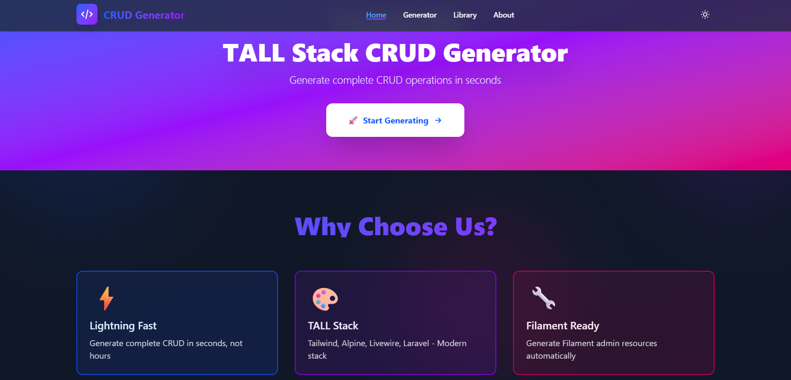
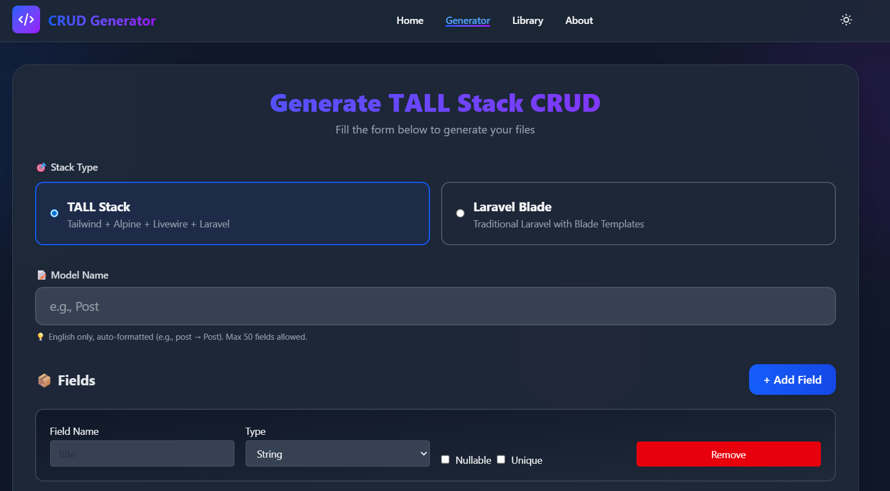
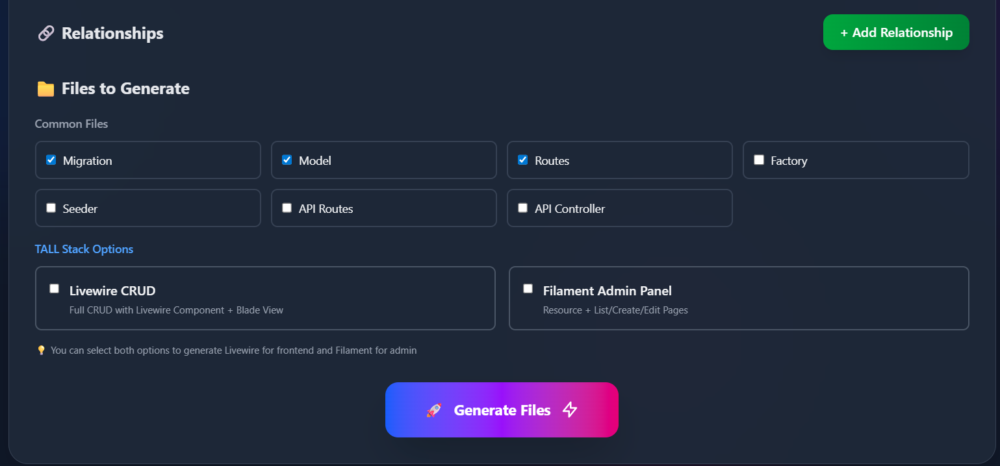
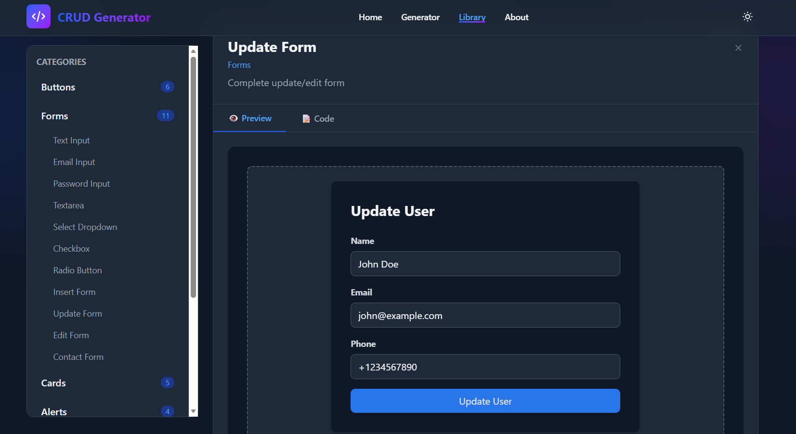
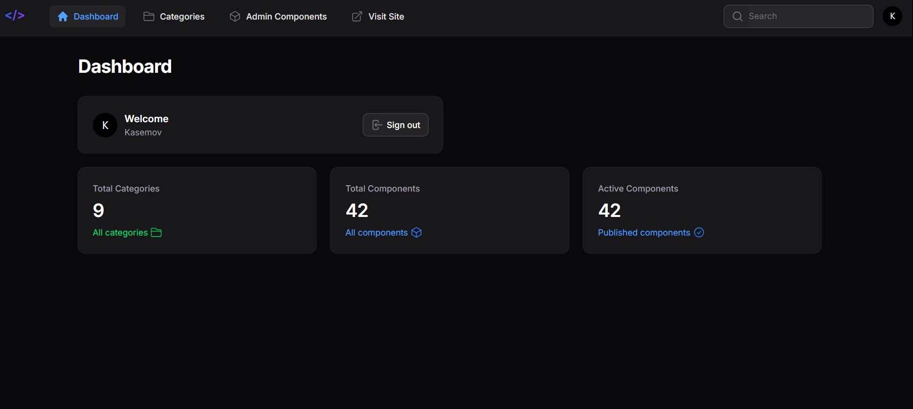

# 🚀 Laravel CRUD Generator & Blade Component Library

[](https://laravel.com)
[](https://livewire.laravel.com)
[](https://filamentphp.com)
[](LICENSE)

A powerful CRUD code generator and reusable Blade component library for Laravel developers. Generate complete CRUD operations in seconds with support for TALL Stack (Tailwind, Alpine, Livewire, Laravel) and traditional Blade templates.

---

## ✨ Features

### 🎯 Code Generator
- ⚡ **Instant Generation** - Create Models, Migrations, Controllers, and Views in seconds
- 🎨 **TALL Stack Support** - Full support for Livewire 3 + Filament 3
- 🔧 **Traditional Blade** - Generate classic Laravel Blade templates
- 🔗 **Relationships** - Support for all Eloquent relationship types
- 📦 **Complete Package** - Factories, Seeders, API endpoints, and more
- 👁️ **Live Preview** - Preview generated code before copying
- 🛡️ **Secure** - Built-in rate limiting and input validation

### 📚 Component Library
- 🎨 **Ready-to-Use Components** - Browse categorized Blade components
- 👀 **Live Preview** - See components in action before using
- 📋 **One-Click Copy** - Copy component code instantly
- 🔍 **Easy Navigation** - Organized by categories
- ⚙️ **Admin Panel** - Manage components via Filament admin

### 🔒 Security Features
- ✅ Rate limiting (5 requests/minute)
- ✅ PHP injection prevention
- ✅ Path traversal protection
- ✅ Secure file uploads
- ✅ Session encryption
- ✅ Security headers (XSS, Clickjacking protection)

---

## 📸 Screenshots

### Home Page


### Code Generator




### Components Library


### Admin Dashboard


---

## 🚀 Quick Start

### Requirements
- PHP 8.2+
- Composer
- Node.js & NPM
- MySQL 8.0+ or SQLite

### Installation

```bash
# Clone the repository
git clone https://github.com/yourusername/crud-generator.git
cd crud-generator

# Install dependencies
composer install
npm install

# Setup environment
cp .env.example .env
php artisan key:generate

# Configure database in .env
DB_CONNECTION=mysql
DB_DATABASE=crud_generator
DB_USERNAME=root
DB_PASSWORD=

# Run migrations and seed
php artisan migrate --seed

# Link storage
php artisan storage:link

# Build assets and start server
npm run build
php artisan serve
```

Visit: `http://127.0.0.1:8000`

### Default Admin Credentials

```
Email: admin@example.com
Password: password
```

⚠️ **Important:** Change these credentials immediately after first login!

---

## 📖 Usage Guide

### Code Generator

1. **Navigate to `/generator`**
2. **Choose Stack Type:**
   - TALL Stack (Livewire + Filament)
   - Traditional Laravel Blade
3. **Enter Model Name:** e.g., `Post`, `Product`, `User`
4. **Add Fields:**
   - Field name: `title`, `price`, `email`
   - Field type: string, text, integer, boolean, date, etc.
   - Mark as nullable or unique
   - Max 50 fields per model
5. **Add Relationships (Optional):**
   - belongsTo, hasMany, belongsToMany, etc.
   - Max 20 relationships per model
6. **Select Files to Generate:**
   - Migration, Model, Controller, Views
   - Routes, Factory, Seeder
   - API endpoints
7. **Generate & Copy** - Click generate and copy your code!

### Component Library

1. **Navigate to `/components`**
2. **Browse Categories** - Click on any category in the sidebar
3. **Select Component** - Click on a component to preview
4. **View Code** - Switch to "Code" tab to see the source
5. **Copy & Use** - Click "Copy" button and paste in your project

### Admin Panel

1. **Login at `/admin`**
2. **Manage Categories** - Create and organize component categories
3. **Add Components:**
   - Upload `.blade.php` files
   - Write code directly in the editor
   - Specify file path
4. **Organize** - Assign components to categories

---

## 🛠️ Tech Stack

- **Backend:** Laravel 12
- **Frontend:** Livewire 3, TailwindCSS 3, Alpine.js 3
- **Admin Panel:** Filament 3
- **Database:** MySQL / SQLite
- **Cache:** Database / Redis

---

## 🔧 Configuration

### Rate Limiting

Adjust rate limits in `routes/web.php`:

```php
Route::get('/generator', CodeGenerator::class)
    ->middleware('throttle:5,1') // 5 requests per minute
    ->name('generator');
```

### Cache Settings

Components are cached for 1 hour. Adjust in `app/Livewire/Components.php`:

```php
Cache::remember('active_categories_with_components', 3600, function() {
    // ...
});
```

### Security Headers

Security headers are configured in `app/Http/Middleware/SecurityHeaders.php`

---

## 🧪 Testing

```bash
# Run all tests
php artisan test

# Run specific test suite
php artisan test --testsuite=Feature

# Run security tests
php artisan test --filter=SecurityTest
```

---

## 📦 Deployment

See [DEPLOYMENT.md](DEPLOYMENT.md) for detailed production deployment instructions.

### Quick Production Checklist

- [ ] Set `APP_ENV=production`
- [ ] Set `APP_DEBUG=false`
- [ ] Change admin credentials
- [ ] Enable HTTPS
- [ ] Configure caching (Redis recommended)
- [ ] Set up queue workers
- [ ] Configure backups
- [ ] Run `php artisan optimize`

---

## 🤝 Contributing

Contributions are welcome! Please feel free to submit a Pull Request.

1. Fork the repository
2. Create your feature branch (`git checkout -b feature/AmazingFeature`)
3. Commit your changes (`git commit -m 'Add some AmazingFeature'`)
4. Push to the branch (`git push origin feature/AmazingFeature`)
5. Open a Pull Request

---

## 🐛 Bug Reports

If you discover a bug, please create an issue on GitHub with:
- Description of the bug
- Steps to reproduce
- Expected behavior
- Screenshots (if applicable)
- Environment details (PHP version, Laravel version, etc.)

---

## 📝 Changelog

### Version 1.1.0 (Latest)
- ✅ Enhanced security (PHP injection prevention, path traversal protection)
- ✅ Added security headers middleware
- ✅ Implemented caching for better performance
- ✅ Added comprehensive tests
- ✅ Improved rate limiting
- ✅ Fixed code generation bugs
- ✅ Updated documentation

### Version 1.0.0
- 🎉 Initial release
- ✅ CRUD code generator
- ✅ Component library
- ✅ Filament admin panel

---

## 📄 License

This project is open-source software licensed under the [MIT License](LICENSE).

---

## 👨‍💻 Author

**Kasemov**
- Email: kasemov134@gmail.com
- GitHub: [@Kasemov123](https://github.com/Kasemov123)

---

## 🙏 Acknowledgments

- [Laravel](https://laravel.com) - The PHP Framework
- [Livewire](https://livewire.laravel.com) - Full-stack framework for Laravel
- [Filament](https://filamentphp.com) - Admin panel framework
- [TailwindCSS](https://tailwindcss.com) - Utility-first CSS framework
- [Alpine.js](https://alpinejs.dev) - Lightweight JavaScript framework

---

## ⭐ Star History

If you find this project useful, please consider giving it a star! ⭐

---

## 📞 Support

For support, email kasemov134@gmail.com or create an issue on GitHub.

---

**Built with ❤️ by Kasemov using TALL Stack & Filament**
